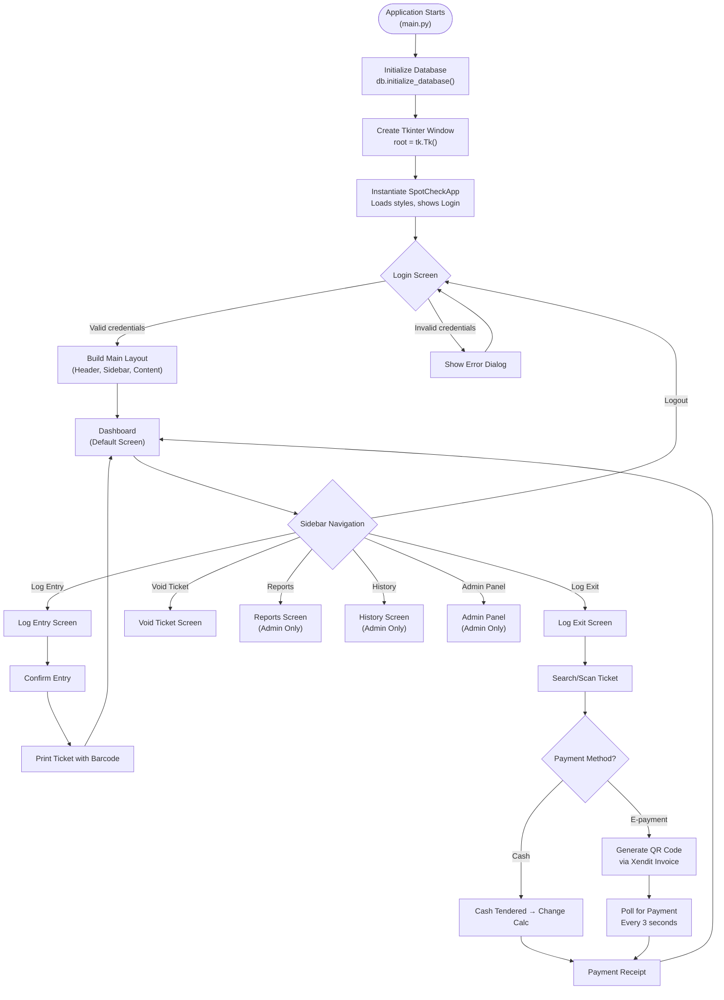

# SpotChecker — Defense Preparation Guide (With Code)

This document explains **how the program works**, the **logic behind every part of the code**, and **what each library is used for**. Every explanation includes the actual code from the project.

---

# 1. Program Flow

## 1.1 Overall System Flow



---

# 2. Code Logic — File by File (With Code)

---

## 2.1 `main.py` — The Entry Point

This is the simplest file. It is the starting point of the entire application.

```python
import tkinter as tk
import database as db
from gui import SpotCheckApp


def main():
    # Step 1: Ensure database and tables exist
    db.initialize_database()

    # Step 2: Launch Tkinter application
    root = tk.Tk()
    app = SpotCheckApp(root)
    root.mainloop()


if __name__ == "__main__":
    main()
```

**Line-by-line explanation:**

| Line | What It Does |
|------|--------------|
| `import tkinter as tk` | Imports the GUI framework that creates the window and all visual elements. |
| `import database as db` | Imports our custom `database.py` module which handles all data storage and retrieval. |
| `from gui import SpotCheckApp` | Imports the main application class from `gui.py` — this contains all the screens. |
| `db.initialize_database()` | Creates the SQLite database file and all tables if they don't exist. Must run before the GUI starts so the app has data to work with. |
| `root = tk.Tk()` | Creates the main application window (the root window that holds everything). |
| `app = SpotCheckApp(root)` | Instantiates the application class, which configures the window and shows the login screen. |
| `root.mainloop()` | Starts the Tkinter event loop — this keeps the window open and responsive to clicks, typing, and other events. The program stays here until the window is closed. |

---

## 2.2 `database.py` — The Data Layer

### 2.2.1 Database Connection

Every function that talks to the database starts by calling this:

```python
_DB_PATH = os.path.join(os.path.dirname(os.path.abspath(__file__)), "spotcheck.db")

def get_connection() -> sqlite3.Connection:
    """Return a connection with foreign keys enabled and Row factory."""
    conn = sqlite3.connect(_DB_PATH)
    conn.execute("PRAGMA foreign_keys = ON")
    conn.row_factory = sqlite3.Row
    return conn
```

**What it does:**
- `_DB_PATH` — Builds the full path to `spotcheck.db` relative to where `database.py` is located. This ensures the database file is always found regardless of where you run the program from.
- `sqlite3.connect(_DB_PATH)` — Opens (or creates) the database file.
- `PRAGMA foreign_keys = ON` — Enables foreign key enforcement. Without this, SQLite would silently ignore foreign key constraints.
- `conn.row_factory = sqlite3.Row` — This lets us access query results by column name (e.g., `row["ticket_id"]`) instead of by index (e.g., `row[0]`). Much more readable.

---

### 2.2.2 Database Initialization & Table Creation

```python
def initialize_database() -> None:
    """Create all tables, seed defaults, and handle migrations."""
    conn = get_connection()
    cur = conn.cursor()

    cur.execute("""
        CREATE TABLE IF NOT EXISTS VehicleType (
            type_id    INTEGER PRIMARY KEY AUTOINCREMENT,
            type_name  TEXT    NOT NULL,
            hourly_rate REAL  NOT NULL
        )
    """)

    cur.execute("""
        CREATE TABLE IF NOT EXISTS Users (
            username      TEXT PRIMARY KEY,
            password_hash TEXT NOT NULL,
            display_name  TEXT NOT NULL,
            role          TEXT NOT NULL
        )
    """)

    cur.execute("""
        CREATE TABLE IF NOT EXISTS Floor (
            floor_id INTEGER PRIMARY KEY AUTOINCREMENT,
            name     TEXT NOT NULL,
            capacity INTEGER NOT NULL
        )
    """)

    cur.execute("""
        CREATE TABLE IF NOT EXISTS Settings (
            id              INTEGER PRIMARY KEY,
            total_capacity  INTEGER NOT NULL
        )
    """)

    cur.execute("""
        CREATE TABLE IF NOT EXISTS Ticket (
            ticket_id   TEXT     PRIMARY KEY,
            plate_no    TEXT     NOT NULL,
            type_id     INTEGER  NOT NULL REFERENCES VehicleType(type_id),
            floor_id    INTEGER  REFERENCES Floor(floor_id),
            entry_time  DATETIME NOT NULL,
            status      TEXT     NOT NULL DEFAULT 'Active',
            void_reason TEXT
        )
    """)

    cur.execute("""
        CREATE TABLE IF NOT EXISTS Payment (
            payment_id     INTEGER PRIMARY KEY AUTOINCREMENT,
            ticket_id      TEXT    NOT NULL REFERENCES Ticket(ticket_id),
            exit_time      DATETIME NOT NULL,
            total_fee      REAL    NOT NULL,
            payment_method TEXT    NOT NULL
        )
    """)
```

**What it does:**
- `CREATE TABLE IF NOT EXISTS` — Creates each table only if it doesn't already exist. This means the function is safe to call every time the app starts.
- **VehicleType** — Stores vehicle categories (Car, Motorcycle, etc.) and their hourly rates.
- **Users** — Stores login credentials. Passwords are stored as SHA-256 hashes, never in plain text.
- **Floor** — Each row represents a parking floor with a name and slot capacity.
- **Settings** — A single-row configuration table for system-wide settings.
- **Ticket** — The core table. Each parked vehicle gets one row. `status` can be `'Active'`, `'Closed'`, or `'Voided'`.
- **Payment** — Created when a vehicle exits. Links back to the Ticket via `ticket_id`.

---

### 2.2.3 Migrations (Upgrading Old Databases)

```python
    # Migration: add void_reason if missing
    columns = [row["name"] for row in cur.execute("PRAGMA table_info(Ticket)")]
    if "void_reason" not in columns:
        cur.execute("ALTER TABLE Ticket ADD COLUMN void_reason TEXT")

    if "void_time" not in columns:
        cur.execute("ALTER TABLE Ticket ADD COLUMN void_time DATETIME")

    if "floor_id" not in columns:
        cur.execute("ALTER TABLE Ticket ADD COLUMN floor_id INTEGER REFERENCES Floor(floor_id)")
        cur.execute("UPDATE Ticket SET floor_id = 1 WHERE floor_id IS NULL")
```

**What it does:**
- `PRAGMA table_info(Ticket)` — Returns the list of column names in the Ticket table.
- If new columns like `void_reason`, `void_time`, or `floor_id` are missing (because the database was created by an older version), they are added dynamically using `ALTER TABLE`.
- This migration pattern ensures the app never crashes when opening an older database — it upgrades it automatically.

---

### 2.2.4 Seeding Default Data

```python
    # Seed VehicleType
    cur.execute("SELECT COUNT(*) AS cnt FROM VehicleType")
    if cur.fetchone()["cnt"] == 0:
        cur.execute("INSERT INTO VehicleType (type_name, hourly_rate) VALUES (?, ?)", ("Car", 50))
        cur.execute("INSERT INTO VehicleType (type_name, hourly_rate) VALUES (?, ?)", ("Motorcycle", 30))

    # Seed Users
    cur.execute("SELECT COUNT(*) AS cnt FROM Users")
    if cur.fetchone()["cnt"] == 0:
        import hashlib
        default_hash = hashlib.sha256("admin".encode()).hexdigest()
        cur.execute(
            "INSERT INTO Users (username, password_hash, display_name, role) VALUES (?, ?, ?, ?)",
            ("admin", default_hash, "Super Admin", "Admin"),
        )
```

**What it does:**
- Checks if the tables are empty (`COUNT(*) == 0`).
- If empty, inserts default vehicle types (Car at ₱50/hr, Motorcycle at ₱30/hr) and a default admin account (username: `admin`, password: `admin`).
- The admin password is hashed with SHA-256 before storage — `hashlib.sha256("admin".encode()).hexdigest()` produces a 64-character hex string.

---

### 2.2.5 Ticket ID Generator

```python
def _next_ticket_id(cursor: sqlite3.Cursor) -> str:
    """Generate the next ticket ID in the form TKT-NNNN."""
    row = cursor.execute(
        "SELECT MAX(CAST(SUBSTR(ticket_id, 5) AS INT)) AS max_num FROM Ticket"
    ).fetchone()
    next_num = (row["max_num"] or 0) + 1
    return "TKT-" + str(next_num).zfill(4)
```

**What it does:**
- `SUBSTR(ticket_id, 5)` — Extracts the number part from `"TKT-0001"` → `"0001"`.
- `CAST(... AS INT)` — Converts the string `"0001"` to integer `1`.
- `MAX(...)` — Finds the highest existing ticket number.
- `+ 1` — Increments it.
- `.zfill(4)` — Pads with zeros: `2` → `"0002"`.
- Result: `"TKT-0002"`.

---

### 2.2.6 Log Entry (Vehicle Entering)

```python
def log_entry(plate_no: str, type_id: int, floor_id: int) -> str:
    plate_no = plate_no.strip().upper()
    if not plate_no:
        raise ValueError("Plate number cannot be empty.")

    conn = get_connection()
    cur = conn.cursor()
    
    # Check capacity for specific floor
    floor_row = cur.execute("""
        SELECT capacity - (SELECT COUNT(*) FROM Ticket WHERE floor_id = ? AND status = 'Active') AS available
        FROM Floor WHERE floor_id = ?
    """, (floor_id, floor_id)).fetchone()
    
    if not floor_row or floor_row["available"] <= 0:
        conn.close()
        raise ValueError("Selected floor is full. Cannot log a new entry.")

    try:
        cur.execute("BEGIN")
        ticket_id = _next_ticket_id(cur)
        cur.execute("""
            INSERT INTO Ticket (ticket_id, plate_no, type_id, floor_id, entry_time, status)
            VALUES (?, ?, ?, ?, datetime('now','localtime'), 'Active')
        """, (ticket_id, plate_no, type_id, floor_id))
        conn.commit()
    except Exception:
        conn.rollback()
        raise
    finally:
        conn.close()
    return ticket_id
```

**What it does:**
1. Validates the plate number (strips whitespace, converts to uppercase).
2. Checks if the selected floor still has capacity using a subquery: `capacity - COUNT(active tickets on that floor)`.
3. Uses `BEGIN`/`COMMIT` for transaction safety — if anything fails, `ROLLBACK` ensures the database stays consistent.
4. `datetime('now','localtime')` — SQLite function that gets the current date and time in the local timezone.
5. Returns the generated ticket ID (e.g., `"TKT-0005"`).

---

### 2.2.7 Fee Computation

```python
def compute_fee(hours_elapsed: float, hourly_rate: float) -> float:
    """Compute parking fee: ceil(hours) × rate, minimum 1 hour."""
    billable_hours = max(1, math.ceil(hours_elapsed))
    return billable_hours * hourly_rate
```

**What it does:**
- `math.ceil(hours_elapsed)` — Rounds up to the nearest whole hour. 1.1 hours → 2 hours.
- `max(1, ...)` — Ensures minimum billing of 1 hour even if the vehicle was parked for only a few minutes.
- Example: 2.3 hours at ₱50/hr = `max(1, ceil(2.3))` × 50 = 3 × 50 = **₱150**.

---

### 2.2.8 Log Exit (Vehicle Leaving)

```python
def log_exit(ticket_id: str, payment_method: str) -> dict:
    conn = get_connection()
    cur = conn.cursor()
    try:
        cur.execute("BEGIN")
        row = cur.execute("""
            SELECT t.ticket_id, t.plate_no, v.type_name, v.hourly_rate,
                   t.entry_time, t.status,
                   ROUND((julianday(datetime('now','localtime')) - julianday(t.entry_time)) * 24, 2) AS hours_elapsed
            FROM Ticket t
            JOIN VehicleType v ON t.type_id = v.type_id
            WHERE t.ticket_id = ?
        """, (ticket_id,)).fetchone()

        if row is None:
            raise ValueError("Ticket not found.")
        if row["status"] == "Closed":
            raise ValueError("This ticket is already closed.")
        if row["status"] == "Voided":
            raise ValueError("This ticket has already been voided.")

        hours_elapsed = row["hours_elapsed"]
        total_fee = compute_fee(hours_elapsed, row["hourly_rate"])

        cur.execute("UPDATE Ticket SET status = 'Closed' WHERE ticket_id = ?", (ticket_id,))
        cur.execute("""
            INSERT INTO Payment (ticket_id, exit_time, total_fee, payment_method)
            VALUES (?, datetime('now','localtime'), ?, ?)
        """, (ticket_id, total_fee, payment_method))
        conn.commit()

        receipt = {
            "ticket_id": row["ticket_id"],
            "plate_no": row["plate_no"],
            "type_name": row["type_name"],
            "entry_time": row["entry_time"],
            "exit_time": datetime.now().strftime("%Y-%m-%d %H:%M:%S"),
            "hours_elapsed": hours_elapsed,
            "total_fee": total_fee,
            "payment_method": payment_method,
        }
    except Exception:
        conn.rollback()
        raise
    finally:
        conn.close()
    return receipt
```

**What it does:**
1. `julianday(now) - julianday(entry_time)` — SQLite computes the time difference in days. Multiply by 24 to get hours.
2. Validates the ticket status — prevents double-closing or closing voided tickets.
3. Computes the fee using `compute_fee()`.
4. Updates the ticket status to `'Closed'`.
5. Inserts a `Payment` record with the exit time, fee, and payment method.
6. Returns a receipt dictionary used by the GUI to display the confirmation.

---

### 2.2.9 Lost Ticket Exit

```python
def log_lost_ticket_exit(plate_no: str, payment_method: str) -> dict:
    plate_no = plate_no.strip().upper()
    conn = get_connection()
    cur = conn.cursor()
    try:
        cur.execute("BEGIN")
        row = cur.execute("""
            SELECT t.ticket_id, t.plate_no, v.type_name, v.hourly_rate, t.entry_time,
                   ROUND((julianday(datetime('now','localtime')) - julianday(t.entry_time)) * 24, 2) AS hours_elapsed
            FROM Ticket t
            JOIN VehicleType v ON t.type_id = v.type_id
            WHERE t.plate_no = ? AND t.status = 'Active'
            ORDER BY t.entry_time DESC LIMIT 1
        """, (plate_no,)).fetchone()

        if row is None:
            raise ValueError(f"No active ticket found for plate {plate_no}.")

        settings = get_settings()
        parking_fee = compute_fee(row["hours_elapsed"], row["hourly_rate"])
        total_fee = parking_fee + settings.get("lost_ticket_fee", 200.0)
        # ...closes ticket and inserts payment same as log_exit...
```

**What it does:**
- Searches for an active ticket by plate number (not ticket ID, since the ticket is lost).
- Calculates the normal parking fee, then **adds the lost ticket penalty** from Settings (default ₱200).
- Total = normal fee + lost ticket fee. This incentivizes drivers to keep their tickets.

---

### 2.2.10 Void Ticket

```python
def void_ticket(ticket_id: str, void_reason: str) -> dict:
    conn = get_connection()
    cur = conn.cursor()
    try:
        cur.execute("BEGIN")
        row = cur.execute("""
            SELECT t.ticket_id, t.plate_no, v.type_name, t.entry_time, t.status
            FROM Ticket t JOIN VehicleType v ON t.type_id = v.type_id
            WHERE t.ticket_id = ?
        """, (ticket_id,)).fetchone()

        if row["status"] == "Closed":
            raise ValueError("This ticket is already closed.")
        if row["status"] == "Voided":
            raise ValueError("This ticket has already been voided.")

        cur.execute(
            "UPDATE Ticket SET status = 'Voided', void_reason = ?, void_time = datetime('now','localtime') WHERE ticket_id = ?",
            (void_reason, ticket_id),
        )
        conn.commit()
```

**What it does:**
- Changes ticket status to `'Voided'` — the slot is freed but no payment is recorded.
- Stores the reason and timestamp for accountability/auditing.

---

### 2.2.11 User Authentication

```python
def verify_login(username: str, password: str) -> dict | None:
    import hashlib
    conn = get_connection()
    pw_hash = hashlib.sha256(password.encode()).hexdigest()
    row = conn.execute(
        "SELECT username, display_name, role FROM Users WHERE username = ? AND password_hash = ?",
        (username, pw_hash)
    ).fetchone()
    conn.close()
    return dict(row) if row else None
```

**What it does:**
- Hashes the entered password with SHA-256 and compares it to the stored hash.
- `hashlib.sha256(password.encode()).hexdigest()` — e.g., `"admin"` becomes `"8c6976e5b5410415bde908bd4dee15dfb167a9c873fc4bb8a81f6f2ab448a918"`.
- Returns user info if credentials match, `None` if they don't.
- **Security**: Even if someone accesses the database file, they cannot read passwords — they only see the hash.

---

### 2.2.12 Transaction History Query

```python
def get_transaction_history(date_from=None, date_to=None, plate_query=None) -> list[dict]:
    conn = get_connection()
    sql = """
        SELECT t.ticket_id, t.plate_no, v.type_name, t.entry_time, p.exit_time,
               ROUND((julianday(p.exit_time) - julianday(t.entry_time)) * 24, 2) AS hours_elapsed,
               p.total_fee, p.payment_method
        FROM Ticket t
        JOIN VehicleType v ON t.type_id = v.type_id
        JOIN Payment p ON t.ticket_id = p.ticket_id
        WHERE t.status = 'Closed'
    """
    params = []
    if date_from:
        sql += " AND date(p.exit_time) >= ?"
        params.append(date_from)
    if date_to:
        sql += " AND date(p.exit_time) <= ?"
        params.append(date_to)
    if plate_query:
        sql += " AND t.plate_no LIKE ?"
        params.append(f"%{plate_query.upper()}%")
    sql += " ORDER BY p.exit_time DESC"

    rows = conn.execute(sql, params).fetchall()
    conn.close()
    return [dict(r) for r in rows]
```

**What it does:**
- Dynamically builds a SQL query based on which filters the user selected.
- **Parameterized queries** (`?` placeholders + `params` list) — this is the proper way to build SQL. It prevents SQL injection attacks because user input is never directly concatenated into the SQL string.
- `LIKE ?` with `f"%{plate_query}%"` — allows partial plate number matching.

---

## 2.3 `gui.py` — The Presentation Layer

### 2.3.1 Imports & API Key Loading

```python
import tkinter as tk
from tkinter import ttk, messagebox
from datetime import datetime
import database as db
import qrcode
from PIL import Image, ImageTk
from tkcalendar import DateEntry
import os
import requests
import base64
from dotenv import load_dotenv

load_dotenv()
XENDIT_API_KEY = os.environ.get("XENDIT_SECRET_KEY", "")
```

**What each import does:**

| Import | Purpose |
|--------|---------|
| `tkinter` | The main GUI framework — creates windows, buttons, labels, etc. |
| `ttk` | Themed widgets — Treeview (tables), Combobox (dropdowns), Scrollbar |
| `messagebox` | Popup dialogs for errors, warnings, and confirmations |
| `datetime` | Gets the current time for timestamps on tickets and receipts |
| `database as db` | Our custom data layer — all database reads/writes go through this |
| `qrcode` | Generates QR codes from the Xendit invoice URL for E-payment |
| `PIL (Image, ImageTk)` | Converts the QR code image into a format Tkinter can display |
| `DateEntry` | Interactive calendar date pickers for the History screen |
| `os` | Reads environment variables (API key) |
| `requests` | Sends HTTP API calls to Xendit servers |
| `base64` | Encodes the API key for Xendit's Basic Auth header |
| `load_dotenv()` | Reads the `.env` file and loads the Xendit API key into the environment |

---

### 2.3.2 Color Palette & Fonts (Design System)

```python
COLORS = {
    "header_bg": "#1B2A4A",      # Dark navy blue for the top bar
    "sidebar_bg": "#162037",      # Even darker blue for the sidebar
    "body_bg": "#F0F2F5",         # Light gray background for content area
    "card_bg": "#FFFFFF",          # White cards
    "accent_blue": "#3B82F6",      # Primary action color
    "accent_green": "#22C55E",     # Success / confirm actions
    "accent_red": "#EF4444",       # Danger / void actions
    "accent_orange": "#F59E0B",    # Warning / pending states
    "table_row_hover": "#2563EB",  # Selected row highlight
    # ... 20+ more colors
}

FONTS = {
    "header_title": ("Segoe UI", 20, "bold"),
    "counter_number": ("Segoe UI", 48, "bold"),
    "body": ("Segoe UI", 13),
    "button": ("Segoe UI", 13, "bold"),
    "small": ("Segoe UI", 11),
    # ... 15+ more font definitions
}
```

**Why this matters:**
- All colors and fonts are defined in **one place**. If a panelist asks "can you change the theme?", you only need to change these dictionaries — every widget in the entire app will update automatically.
- This is the **design system pattern** — a best practice in professional software development.

---

### 2.3.3 Custom Reusable Widgets

#### StyledButton — Button with Hover Effects

```python
class StyledButton(tk.Button):
    def __init__(self, parent, text, color_key="btn_primary", hover_key="btn_primary_hover",
                 fg="white", command=None, **kwargs):
        self._color = COLORS[color_key]
        self._hover = COLORS[hover_key]
        super().__init__(parent, text=text, font=FONTS["button"], bg=self._color, fg=fg,
                         relief="flat", cursor="hand2", command=command, **kwargs)
        self.bind("<Enter>", lambda e: self._on_enter())
        self.bind("<Leave>", lambda e: self._on_leave())

    def _on_enter(self):
        if str(self.cget("state")) != "disabled":
            self.configure(bg=self._hover)

    def _on_leave(self):
        if str(self.cget("state")) != "disabled":
            self.configure(bg=self._color)
```

**What it does:**
- Creates a flat-styled button with no 3D border (`relief="flat"`).
- `<Enter>` / `<Leave>` events detect when the mouse hovers over the button and changes the background color dynamically, creating a hover effect.
- If the button is disabled, the hover effect is suppressed.

#### Helper Functions

```python
def format_elapsed(hours):
    """Convert decimal hours to 'Xh Ym' string."""
    total_min = int(hours * 60)
    h = total_min // 60
    m = total_min % 60
    return f"{h}h {m:02d}m"

def format_currency(value):
    """Format value as Philippine peso string."""
    return f"₱{value:,.2f}"
```

**What they do:**
- `format_elapsed(2.75)` → `"2h 45m"` — converts decimal hours to a readable format.
- `format_currency(1500)` → `"₱1,500.00"` — formats numbers with peso sign, commas, and 2 decimal places.

---

### 2.3.4 Application Initialization

```python
class SpotCheckApp:
    def __init__(self, root):
        self.root = root
        self.root.title("SpotCheck — Parking Management")
        self.root.minsize(MIN_WIDTH, MIN_HEIGHT)
        self.root.state("zoomed")  # Start maximized

        self.logged_in_user = None
        self._dashboard_refresh_id = None
        self._mousewheel_binding_id = None

        self._setup_styles()
        self._show_login_screen()
```

**What it does:**
- Sets the window title and minimum size (1080×700 pixels).
- `state("zoomed")` — opens the window maximized.
- Initializes state variables to track the logged-in user and any pending refresh timers.
- Configures all ttk widget styles, then shows the login screen.

---

### 2.3.5 Login Screen

```python
def _show_login_screen(self):
    # ... creates the login UI ...

    def _on_login(event=None):
        user = db.verify_login(user_var.get().strip(), pass_var.get())
        if user:
            self.logged_in_user = user
            for w in self.root.winfo_children():
                w.destroy()
            self._build_layout()
            self._show_dashboard()
            self._tick_clock()
        else:
            messagebox.showerror("Login Failed", "Invalid username or password.")

    pass_entry.bind("<Return>", _on_login)  # Press Enter to login
    user_entry.bind("<Return>", _on_login)
```

**What it does:**
- Calls `db.verify_login()` with the entered credentials.
- If valid: destroys the login screen, builds the main layout (header + sidebar + content), and shows the dashboard.
- If invalid: shows an error popup.
- `bind("<Return>")` — allows the user to press Enter to log in instead of clicking the button.

---

### 2.3.6 Navigation System

```python
def _navigate(self, key):
    screens = {
        "dashboard": self._show_dashboard,
        "entry": self._show_entry,
        "exit": self._show_exit,
        "void": self._show_void,
        "reports": self._show_reports,
        "history": self._show_history,
        "admin": self._show_admin_panel,
    }
    screens.get(key, self._show_dashboard)()

def _clear_content(self):
    for w in self.content.winfo_children():
        w.destroy()
    if self._dashboard_refresh_id:
        self.root.after_cancel(self._dashboard_refresh_id)
        self._dashboard_refresh_id = None
```

**What it does:**
- `_navigate()` — A routing dictionary. When a sidebar button is clicked, it maps the key to a screen function and calls it.
- `_clear_content()` — Destroys all widgets in the content area before rendering a new screen. Also cancels any pending auto-refresh timers to prevent memory leaks.

---

### 2.3.7 Dashboard Auto-Refresh

```python
def _refresh_dashboard(self):
    try:
        count = db.get_active_ticket_count()
        available = db.get_available_slots()
        self.vehicles_count_label.configure(text=str(count))

        # Multi-floor slot display
        floor_spots = db.get_available_spots_by_floor()
        for i, f in enumerate(floor_spots):
            lbl_text = f"{f['name']}: {f['available']}/{f['capacity']}"
            if f['available'] <= 0:
                lbl_text += " (FULL)"

        # Overstay alert
        overstaying = db.get_overstaying_tickets()
        if overstaying:
            count = len(overstaying)
            text = f"⚠️ ALERT: {count} vehicle{'s' if count != 1 else ''} parked for over 24 hours!"
            self.alert_label.configure(text=text)
            self.alert_banner.pack(fill="x", pady=(0, 18))
        else:
            self.alert_banner.pack_forget()  # Hide the banner

    except Exception:
        pass  # Widget may have been destroyed during navigation

    # Schedule next refresh in 10 seconds
    self._dashboard_refresh_id = self.root.after(10000, self._refresh_dashboard)
```

**What it does:**
- Queries the database for live data and updates all dashboard labels.
- Dynamically creates floor labels — if a new floor is added, it appears automatically on next refresh.
- `pack_forget()` — hides the alert banner if no vehicles are overstaying.
- `root.after(10000, self._refresh_dashboard)` — schedules the function to run again in 10 seconds. This is Tkinter's non-blocking way of creating a timer (it doesn't freeze the UI).

---

### 2.3.8 Thermal Printer with ESC/POS Barcode

```python
def print_receipt_raw(text_content: str, barcode_data: str = None):
    try:
        import win32print
        printer_name = win32print.GetDefaultPrinter()
        hPrinter = win32print.OpenPrinter(printer_name)
        try:
            hJob = win32print.StartDocPrinter(hPrinter, 1, ("SpotCheck Receipt", None, "RAW"))
            win32print.StartPagePrinter(hPrinter)

            raw_data = text_content.encode("utf-8")

            if barcode_data:
                raw_data += (
                    b"\n" +
                    b"\x1B\x61\x01" +   # ESC a 1  = Align Center
                    b"\x1D\x48\x02" +   # GS  H 2  = Print text BELOW barcode
                    b"\x1D\x68\x50" +   # GS  h 80 = Barcode height: 80 dots
                    b"\x1D\x77\x03" +   # GS  w 3  = Barcode width: 3
                    b"\x1D\x6B\x04" +   # GS  k 4  = Barcode type: CODE39
                    str(barcode_data).encode("ascii") + b"\x00" +  # Barcode data + NULL terminator
                    b"\n" +
                    b"\x1B\x61\x00"     # ESC a 0  = Align Left (reset)
                )

            raw_data += b"\n\n\n\n\n\x1d\x56\x00"  # Feed paper + cut
            win32print.WritePrinter(hPrinter, raw_data)
```

**What it does:**
- Opens the default Windows printer in RAW mode (sends bytes directly to the printer hardware).
- The text content is encoded to UTF-8 bytes.
- **ESC/POS commands** are the universal language for thermal receipt printers:
  - `\x1B\x61\x01` — Center alignment
  - `\x1D\x68\x50` — Set barcode height to 80 dots
  - `\x1D\x6B\x04` — Print a CODE39 barcode (a standard format that most barcode scanners can read)
  - The ticket ID bytes are appended, followed by a null terminator `\x00`
  - `\x1D\x56\x00` — Cut the paper
- The barcode is printed on the entry ticket so cashiers can scan it at exit.

---

### 2.3.9 Xendit E-Payment Integration

#### Step 1: Create the Invoice

```python
def _process_xendit_payment(self, ticket, fee):
    auth_string = XENDIT_API_KEY + ":"
    headers = {
        "Authorization": "Basic " + base64.b64encode(auth_string.encode()).decode(),
        "Content-Type": "application/json"
    }
    payload = {
        "external_id": f"ticket_{ticket['ticket_id']}_{int(datetime.now().timestamp())}",
        "amount": float(fee),
        "description": f"Parking Fee for {ticket['plate_no']}",
        "invoice_duration": 300,   # Expires in 5 minutes
        "currency": "PHP"
    }
    res = requests.post("https://api.xendit.co/v2/invoices", json=payload, headers=headers)
    data = res.json()
    invoice_url = data.get("invoice_url")
    invoice_id = data.get("id")
    self._show_xendit_qr_popup(ticket, fee, invoice_url, invoice_id)
```

**What it does:**
- `base64.b64encode(auth_string.encode())` — Encodes the API key for HTTP Basic Authentication (a standard web authentication method).
- Sends a `POST` request to Xendit's invoice API with the fee amount and a description.
- `invoice_duration: 300` — The payment link expires after 5 minutes.
- Xendit returns an `invoice_url` (a checkout page) and an `id` (for status checking).

#### Step 2: Display QR Code

```python
def _show_xendit_qr_popup(self, ticket, fee, invoice_url, invoice_id):
    popup = tk.Toplevel(self.root)

    qr = qrcode.QRCode(version=1, box_size=5, border=1)
    qr.add_data(invoice_url)
    qr.make(fit=True)
    img = qr.make_image(fill_color="black", back_color="white")
    popup.qr_img = ImageTk.PhotoImage(img)
    tk.Label(inner, image=popup.qr_img).pack(pady=10)
```

**What it does:**
- `qrcode.QRCode()` — Creates a QR code object.
- `qr.add_data(invoice_url)` — Encodes the Xendit checkout URL into the QR code.
- `ImageTk.PhotoImage(img)` — Converts the PIL image into a Tkinter-compatible image.
- The QR code is displayed on screen. The driver scans it with their phone, which opens the Xendit payment page.

#### Step 3: Poll for Payment Completion

```python
    def check_status():
        if not popup.winfo_exists(): return
        try:
            headers = {"Authorization": "Basic " + base64.b64encode((XENDIT_API_KEY + ":").encode()).decode()}
            res = requests.get(f"https://api.xendit.co/v2/invoices/{invoice_id}", headers=headers)
            if res.status_code == 200:
                status = res.json().get("status")
                if status == "PAID":
                    status_label.config(text="Payment Successful!", fg=COLORS["accent_green"])
                    popup.after(1000, lambda: finalize_payment())
                    return
                elif status == "EXPIRED":
                    status_label.config(text="Invoice Expired", fg=COLORS["accent_red"])
                    return
        except Exception:
            pass
        popup.after(3000, check_status)  # Check again in 3 seconds

    def finalize_payment():
        popup.destroy()
        receipt = db.log_exit(ticket["ticket_id"], "E-payment")
        self._show_receipt_popup(receipt, change_amount=0.0)
        self._show_dashboard()
```

**What it does:**
- `popup.after(3000, check_status)` — Every 3 seconds, sends a `GET` request to Xendit to check if the invoice has been paid.
- If `status == "PAID"` → closes the popup, calls `db.log_exit()` to finalize the transaction, and shows the receipt.
- If `status == "EXPIRED"` → shows an expiry message.
- `popup.winfo_exists()` — Safety check to prevent errors if the user manually closed the popup.

---

### 2.3.10 Excel Export

```python
def export_to_excel(data: list[dict], default_filename: str) -> None:
    from tkinter import filedialog
    import pandas as pd

    if not data:
        messagebox.showwarning("No Data", "There is no data to export.")
        return

    filepath = filedialog.asksaveasfilename(
        defaultextension=".xlsx",
        filetypes=[("Excel files", "*.xlsx")],
        initialfile=default_filename,
    )
    if not filepath:
        return

    df = pd.DataFrame(data)
    with pd.ExcelWriter(filepath, engine='openpyxl') as writer:
        df.to_excel(writer, index=False, sheet_name='Report')
        worksheet = writer.sheets['Report']
        for column_cells in worksheet.columns:
            length = max(len(str(cell.value)) for cell in column_cells)
            worksheet.column_dimensions[column_cells[0].column_letter].width = length + 2
```

**What it does:**
- Opens a "Save As" file dialog so the user can choose where to save.
- `pd.DataFrame(data)` — Converts the list of dictionaries into a table structure.
- `df.to_excel()` — Writes the data to an Excel file.
- The column auto-sizing loop measures the longest value in each column and sets the column width accordingly — so the Excel file looks clean without manual adjustments.

---

# 3. Libraries & What They Do

## 3.1 Built-in Python Libraries (No Installation Needed)

| Library | Code Example | Purpose in SpotChecker |
|---------|-------------|----------------------|
| **tkinter** | `root = tk.Tk()` | The **main GUI framework**. Creates the window, buttons, labels, text fields, tables, popup dialogs — everything you see on screen. Built into Python. |
| **tkinter.ttk** | `ttk.Treeview(...)`, `ttk.Combobox(...)` | **Themed widgets** — specifically `Treeview` for data tables (active tickets, history), `Combobox` for dropdown menus (vehicle type, payment method), and `Style` for customizing appearance. |
| **tkinter.messagebox** | `messagebox.showerror("Error", str(e))` | Shows standard **popup dialog boxes** — error alerts, warnings, confirmations ("Are you sure you want to void?"). |
| **sqlite3** | `conn = sqlite3.connect(_DB_PATH)` | The **database engine**. SQLite stores all data in a single file (`spotcheck.db`). No database server installation needed. Supports full SQL queries, transactions, and ACID compliance. |
| **datetime** | `datetime.now().strftime("%Y-%m-%d %H:%M:%S")` | Handles **timestamps** — recording entry/exit times, formatting dates for display, and calculating time differences for the ticket reopen window. |
| **math** | `math.ceil(hours_elapsed)` | **Rounds hours up** for billing. `ceil(1.1)` = 2. Ensures even a 1-minute overstay into the next hour is billed. |
| **os** | `os.environ.get("XENDIT_SECRET_KEY")` | **File paths and environment variables** — locates the database file and reads the API key from the `.env` file. |
| **hashlib** | `hashlib.sha256(password.encode()).hexdigest()` | **Password hashing** — converts passwords into irreversible 64-character hex strings for secure storage. |
| **base64** | `base64.b64encode(auth_string.encode())` | **Encoding** — Xendit's API requires the secret key to be Base64-encoded in the HTTP `Authorization` header (standard Basic Auth). |

## 3.2 Third-Party Libraries (from `requirements.txt`)

| Library | Code Example | Purpose in SpotChecker |
|---------|-------------|----------------------|
| **python-dotenv** | `load_dotenv()` | **Loads the `.env` file** containing the Xendit API key. This is a security best practice — the API key is never hardcoded in the source code. If the code is shared on GitHub, the `.env` file stays private (via `.gitignore`). |
| **requests** | `requests.post("https://api.xendit.co/v2/invoices", json=payload, headers=headers)` | **HTTP client** — sends REST API requests to Xendit. `POST` to create invoices, `GET` to check payment status. Handles JSON encoding/decoding automatically. |
| **qrcode[pil]** | `qr = qrcode.QRCode(); qr.add_data(url); img = qr.make_image()` | **QR code generator** — converts the Xendit checkout URL into a scannable QR code image. The `[pil]` extra enables generating actual image objects (via Pillow) that can be displayed in the GUI. |
| **Pillow (PIL)** | `ImageTk.PhotoImage(img)` | **Image processing** — converts the QR code PIL image into a format that Tkinter can render inside a Label widget. Without Pillow, Tkinter can only display very limited image formats. |
| **tkcalendar** | `DateEntry(frame, date_pattern='y-mm-dd', state="readonly")` | **Calendar date picker widget** — creates the interactive calendar popups in the Transaction History screen. Users click a dropdown to visually select dates instead of typing `2026-06-29` manually. |
| **pandas** | `df = pd.DataFrame(data); df.to_excel(writer, index=False)` | **Data manipulation** — converts query results (lists of dictionaries) into structured DataFrames. DataFrames can be easily filtered, sorted, and exported to Excel with proper headers. |
| **openpyxl** | `pd.ExcelWriter(filepath, engine='openpyxl')` | **Excel file writer** — the engine pandas uses internally to create `.xlsx` files. Also provides worksheet-level features like auto-sizing column widths for clean output. |
| **xendit-python** | *(listed in requirements.txt)* | **Xendit SDK** — listed as a dependency for potential future use. Currently, the app communicates with Xendit directly via `requests` using REST API calls, which gives full control over the HTTP requests. |

## 3.3 Optional Libraries (Used When Available)

| Library | Code Example | Purpose |
|---------|-------------|---------|
| **win32print** | `win32print.OpenPrinter(printer_name)` | Windows-only. **Sends raw ESC/POS data to thermal receipt printers**. Imported inside `try/except` so the app works even on systems without a printer. |
| **opencv (cv2)** | `cap = cv2.VideoCapture(0)` | **Webcam access** — captures live video from a USB camera for the barcode/QR scanner on the Log Exit screen. |
| **pyzbar** | `pyzbar.decode(frame)` | **Barcode decoder** — reads and decodes barcodes from video frames captured by OpenCV. Used to scan the printed entry ticket at exit. |

---

# 4. Quick Defense Q&A Reference

**Q: Why SQLite instead of MySQL/PostgreSQL?**
> SQLite is a file-based database that requires zero server setup. For a single-station parking booth, it's ideal — the entire database is one `spotcheck.db` file. No installation, no configuration, no network needed.

**Q: How do you prevent SQL injection?**
> All queries use **parameterized queries** with `?` placeholders:
> ```python
> cur.execute("SELECT * FROM Ticket WHERE ticket_id = ?", (ticket_id,))
> ```
> User input is never concatenated into SQL strings.

**Q: How are passwords stored?**
> Using **SHA-256 hashing**:
> ```python
> pw_hash = hashlib.sha256(password.encode()).hexdigest()
> ```
> The original password is never saved. During login, we hash the input and compare hashes.

**Q: How does the E-payment work?**
> 1. App sends a `POST` to `api.xendit.co/v2/invoices` with the fee amount.
> 2. Xendit returns an `invoice_url`.
> 3. We convert the URL into a QR code and display it on screen.
> 4. The driver scans it with their phone and pays via GCash/Maya.
> 5. Our app polls Xendit every 3 seconds. Once `status == "PAID"`, the transaction is finalized.

**Q: How does the barcode on the ticket work?**
> We send **ESC/POS commands** (the universal thermal printer protocol) directly to the printer:
> ```python
> b"\x1D\x6B\x04" + barcode_data.encode("ascii") + b"\x00"
> ```
> `\x1D\x6B\x04` tells the printer to print a CODE39 barcode. The printer's firmware renders the barcode image — no image generation needed on our side.

**Q: What happens if the app crashes mid-transaction?**
> All database writes use **transactions**:
> ```python
> cur.execute("BEGIN")
> # ... do work ...
> conn.commit()
> # If error:
> conn.rollback()
> ```
> If a crash occurs, `ROLLBACK` ensures no partial data is saved. SQLite's ACID compliance guarantees data integrity.

**Q: How do you handle multiple floors?**
> Each floor is a row in the `Floor` table. Available slots are computed per-floor:
> ```sql
> SELECT capacity - (SELECT COUNT(*) FROM Ticket WHERE floor_id = ? AND status = 'Active') AS available
> FROM Floor WHERE floor_id = ?
> ```

**Q: Why use `root.after()` instead of `time.sleep()`?**
> `time.sleep()` blocks the entire GUI — the window freezes and becomes unresponsive. `root.after(ms, callback)` schedules a function to run after a delay **without blocking** the event loop. The UI stays fully responsive.
