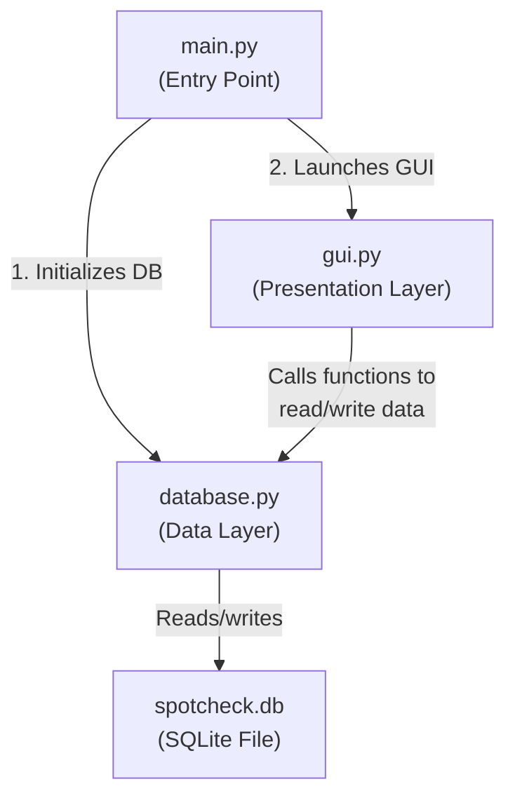
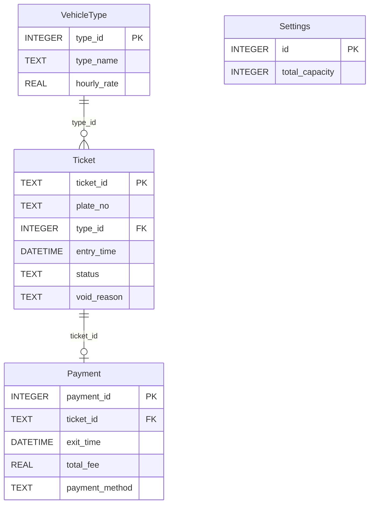
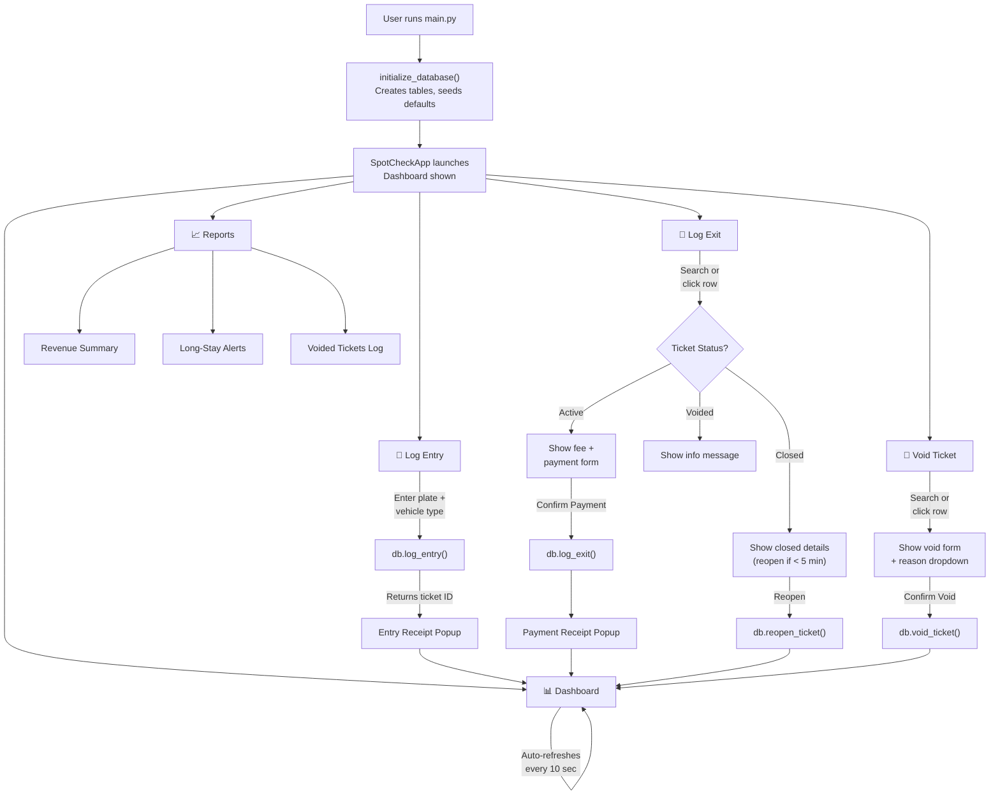
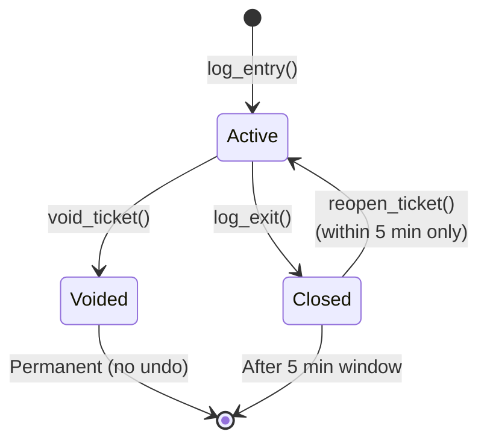

# SpotCheck Parking Management System — Complete Program Walkthrough

> [!NOTE]
> This document is designed as a **defense guide**. It explains **what the program does**, **how every function works**, and **exactly where in the code** each part is implemented. Line numbers and file links are included for quick reference.

---

## 1. Overall Architecture

SpotCheck is a **desktop parking management system** built with **Python**, **Tkinter** (GUI), and **SQLite** (database). It follows a **3-file architecture**:

| File | Role | Lines |
|------|------|-------|
| [main.py](file:///c:/Users/Kaisho/Documents/SpotChecker/main.py) | Entry point — starts the app | 23 |
| [database.py](file:///c:/Users/Kaisho/Documents/SpotChecker/database.py) | All database operations (SQLite) | 593 |
| [gui.py](file:///c:/Users/Kaisho/Documents/SpotChecker/gui.py) | All GUI screens and widgets (Tkinter) | 1653 |



### How It Starts

When you run the program, **[main.py](file:///c:/Users/Kaisho/Documents/SpotChecker/main.py)** does exactly two things:

1. **Line 13** — Calls `db.initialize_database()` to create the database tables if they don't exist yet
2. **Lines 16–18** — Creates the Tkinter window (`tk.Tk()`), passes it to `SpotCheckApp`, and starts the event loop (`root.mainloop()`)

```python
def main():
    db.initialize_database()   # Step 1: Set up the database
    root = tk.Tk()             # Step 2: Create the window
    app = SpotCheckApp(root)   # Step 3: Build all screens
    root.mainloop()            # Step 4: Keep the app running
```

---

## 2. Database Layer — [database.py](file:///c:/Users/Kaisho/Documents/SpotChecker/database.py)

This file handles **everything related to data storage**. It uses Python's built-in `sqlite3` module — no external libraries required. The database file `spotcheck.db` is stored in the same folder as the script.

### 2.1 Database Schema (4 Tables)



| Table | Purpose | Key Columns |
|-------|---------|-------------|
| **VehicleType** | Stores vehicle categories and their hourly parking rates | `type_name` (Car/Motorcycle), `hourly_rate` (₱50/₱30) |
| **Settings** | Stores the total parking capacity | `total_capacity` (default: 50 slots) |
| **Ticket** | One row per vehicle entry; tracks status (Active/Closed/Voided) | `ticket_id`, `plate_no`, `entry_time`, `status` |
| **Payment** | One row per completed payment when a vehicle exits | `exit_time`, `total_fee`, `payment_method` |

---

### 2.2 Every Function in database.py

#### 🔌 Connection Helper

| # | Function | Line | What It Does |
|---|----------|------|--------------|
| 1 | [get_connection()](file:///c:/Users/Kaisho/Documents/SpotChecker/database.py#L24-L29) | 24–29 | Opens a connection to the SQLite database. Enables **foreign keys** (so references between tables are enforced) and sets the **Row factory** (so query results can be accessed by column name like `row["plate_no"]` instead of `row[0]`). Every other function calls this first. |

---

#### 🏗️ Initialization

| # | Function | Line | What It Does |
|---|----------|------|--------------|
| 2 | [initialize_database()](file:///c:/Users/Kaisho/Documents/SpotChecker/database.py#L36-L111) | 36–111 | Called **once at startup**. Creates all 4 tables using `CREATE TABLE IF NOT EXISTS` (safe to run multiple times). Also handles **migration** — if the `void_reason` column doesn't exist in the Ticket table, it adds it (Lines 87–89). Seeds **default data**: inserts Car (₱50/hr) and Motorcycle (₱30/hr) into VehicleType, and sets parking capacity to 50 in Settings — but only if those tables are empty (Lines 91–108). |

> [!TIP]
> The `CREATE TABLE IF NOT EXISTS` pattern means the app won't crash if the database already exists. The migration check on Line 87–89 allows the schema to evolve without losing existing data.

---

#### 🚗 Vehicle Type Lookup

| # | Function | Line | What It Does |
|---|----------|------|--------------|
| 3 | [get_vehicle_types()](file:///c:/Users/Kaisho/Documents/SpotChecker/database.py#L118-L123) | 118–123 | Returns a list of all vehicle types (Car, Motorcycle) with their hourly rates. Used by the GUI to populate the dropdown menu when logging a new entry. |

---

#### 📊 Capacity Helpers

| # | Function | Line | What It Does |
|---|----------|------|--------------|
| 4 | [get_total_capacity()](file:///c:/Users/Kaisho/Documents/SpotChecker/database.py#L130-L137) | 130–137 | Returns the total parking capacity (default 50). Reads from the Settings table. |
| 5 | [get_available_slots()](file:///c:/Users/Kaisho/Documents/SpotChecker/database.py#L140-L153) | 140–153 | Calculates available slots using a **single SQL query**: `total_capacity − COUNT of Active tickets`. For example, if capacity is 50 and 12 cars are parked, it returns 38. |

---

#### 🔢 Ticket ID Generator

| # | Function | Line | What It Does |
|---|----------|------|--------------|
| 6 | [_next_ticket_id()](file:///c:/Users/Kaisho/Documents/SpotChecker/database.py#L160-L166) | 160–166 | **Private function** (the `_` prefix means it's only used internally). Generates sequential ticket IDs like `TKT-0001`, `TKT-0002`, etc. It finds the highest existing number in the database and adds 1. Uses `zfill(4)` to zero-pad to 4 digits. |

---

#### 🎫 Core Ticket Operations (Entry / Exit / Void)

| # | Function | Line | What It Does |
|---|----------|------|--------------|
| 7 | [log_entry()](file:///c:/Users/Kaisho/Documents/SpotChecker/database.py#L173-L206) | 173–206 | **Registers a new vehicle**. Takes `plate_no` and `type_id` as inputs. Validates that the plate isn't empty and that parking isn't full. Generates a new ticket ID, inserts a row into the Ticket table with status `'Active'` and the current timestamp. Uses a **database transaction** (`BEGIN`/`COMMIT`/`ROLLBACK`) to ensure data integrity — if anything fails, no partial data is saved. Returns the generated ticket ID. |
| 8 | [get_active_tickets()](file:///c:/Users/Kaisho/Documents/SpotChecker/database.py#L209-L237) | 209–237 | Returns **all currently parked vehicles** (status = 'Active'). Joins the Ticket and VehicleType tables to include the vehicle type name and hourly rate. Also calculates `hours_elapsed` using SQLite's `julianday()` function — this computes the difference between the current time and entry time in hours. |
| 9 | [get_active_ticket_count()](file:///c:/Users/Kaisho/Documents/SpotChecker/database.py#L240-L247) | 240–247 | Returns just the **count** of active tickets. Faster than fetching all rows when you only need the number. Used by the dashboard to display "Vehicles Inside". |
| 10 | [search_ticket()](file:///c:/Users/Kaisho/Documents/SpotChecker/database.py#L250-L282) | 250–282 | Searches for a ticket by **either** ticket ID (e.g., `TKT-0001`) **or** plate number (e.g., `ABC 123`). Returns the **most recent** match (ordered by `entry_time DESC`). Returns `None` if not found. Used by both the Log Exit and Void Ticket screens. |
| 11 | [compute_fee()](file:///c:/Users/Kaisho/Documents/SpotChecker/database.py#L285-L290) | 285–290 | Calculates the parking fee. Formula: `ceil(hours) × hourly_rate`, with a **minimum of 1 hour**. For example: 0.5 hours at ₱50/hr = ₱50 (1 hour minimum). 2.3 hours at ₱50/hr = ₱150 (rounded up to 3 hours). Uses `math.ceil()` for the rounding. |
| 12 | [log_exit()](file:///c:/Users/Kaisho/Documents/SpotChecker/database.py#L293-L369) | 293–369 | **Processes a vehicle leaving the parking lot.** This is a multi-step operation inside a transaction: (1) Looks up the ticket and validates it's Active, (2) Computes the fee using `compute_fee()`, (3) Updates the ticket status to `'Closed'`, (4) Inserts a Payment record with the exit time, fee, and payment method. Returns a **receipt dictionary** containing all details for the popup. |
| 13 | [void_ticket()](file:///c:/Users/Kaisho/Documents/SpotChecker/database.py#L372-L428) | 372–428 | **Cancels a ticket without charging**. Used for mistakes like wrong plate number or wrong vehicle type. Updates the ticket status to `'Voided'` and saves the `void_reason`. Validates that the ticket exists and is still Active. No Payment record is created. |

> [!IMPORTANT]
> Both `log_exit()` and `void_ticket()` use **database transactions** (`BEGIN`/`COMMIT`/`ROLLBACK`). This means if the program crashes mid-operation, either ALL changes are saved or NONE are — preventing data corruption.

---

#### 🔍 Payment Lookup

| # | Function | Line | What It Does |
|---|----------|------|--------------|
| 14 | [get_payment_for_ticket()](file:///c:/Users/Kaisho/Documents/SpotChecker/database.py#L435-L447) | 435–447 | Retrieves the payment record for a given ticket ID. Returns `None` if no payment exists (i.e., ticket is still active or was voided). Used by the "Closed Ticket Details" screen to check if reopening is possible. |

---

#### 🔄 Reopen Ticket

| # | Function | Line | What It Does |
|---|----------|------|--------------|
| 15 | [reopen_ticket()](file:///c:/Users/Kaisho/Documents/SpotChecker/database.py#L454-L507) | 454–507 | **Reverses a payment** — but only within a **5-minute window** after the exit was processed. Checks that the ticket is Closed (not Active or Voided), calculates how many seconds have passed since payment, and if ≤ 300 seconds (5 minutes), deletes the Payment record and sets the ticket status back to `'Active'`. This handles the real-world scenario where a cashier makes a mistake and needs to redo the transaction. |

> [!WARNING]
> After 5 minutes, reopening is permanently blocked. The 5-minute check is on Line 491: `if elapsed > 300`.

---

#### 📈 Reporting Functions

| # | Function | Line | What It Does |
|---|----------|------|--------------|
| 16 | [get_daily_revenue_summary()](file:///c:/Users/Kaisho/Documents/SpotChecker/database.py#L514-L538) | 514–538 | Returns **today's revenue grouped by vehicle type**. For each type, it shows: number of transactions, total revenue, and average fee. Uses SQL `GROUP BY` and aggregate functions (`COUNT`, `SUM`, `AVG`). Filters by `date(exit_time) = date('now','localtime')` to get only today's data. |
| 17 | [get_daily_total_revenue()](file:///c:/Users/Kaisho/Documents/SpotChecker/database.py#L541-L552) | 541–552 | Returns a **single number** — the total revenue for today. Uses `COALESCE(SUM(...), 0.0)` so it returns `0.0` instead of `NULL` if there are no payments yet. |
| 18 | [get_long_stay_alerts()](file:///c:/Users/Kaisho/Documents/SpotChecker/database.py#L555-L577) | 555–577 | Returns Active tickets where the vehicle has been parked for **more than 8 hours** (configurable via `threshold_hours` parameter). This helps identify potentially abandoned vehicles or vehicles that may have been forgotten. |
| 19 | [get_voided_tickets_today()](file:///c:/Users/Kaisho/Documents/SpotChecker/database.py#L580-L592) | 580–592 | Returns all voided tickets from today. Useful for auditing — shows what corrections were made during the current shift and why. |

---

## 3. GUI Layer — [gui.py](file:///c:/Users/Kaisho/Documents/SpotChecker/gui.py)

This file contains **all visual elements** of the application. It is organized into:
1. **Constants** (colors, fonts)
2. **Reusable widget classes** (buttons, entries, cards)
3. **The main `SpotCheckApp` class** with 5 screens

### 3.1 Design System (Colors & Fonts)

#### [COLORS Dictionary](file:///c:/Users/Kaisho/Documents/SpotChecker/gui.py#L15-L52) — Lines 15–52

A centralized color palette with **30+ named colors**, organized by purpose:

| Category | Example Keys | Purpose |
|----------|-------------|---------|
| Header | `header_bg (#1B2A4A)`, `header_fg (#FFFFFF)` | Dark navy header bar |
| Sidebar | `sidebar_bg (#162037)`, `sidebar_active_bg (#1E3A5F)` | Dark navigation sidebar |
| Body | `body_bg (#F0F2F5)`, `card_bg (#FFFFFF)` | Light gray background with white cards |
| Accents | `accent_blue (#3B82F6)`, `accent_green (#22C55E)`, `accent_red (#EF4444)` | Action colors for buttons and highlights |
| "FULL" state | `full_bg (#FEE2E2)`, `full_fg (#DC2626)` | Red warning when parking is full |

#### [FONTS Dictionary](file:///c:/Users/Kaisho/Documents/SpotChecker/gui.py#L54-L73) — Lines 54–73

All fonts use **Segoe UI** (Windows system font). Sizes range from 11 (small labels) to 48 (big counter numbers on dashboard).

---

### 3.2 Reusable Widget Classes

| # | Class | Lines | What It Does |
|---|-------|-------|--------------|
| 1 | [RoundedFrame](file:///c:/Users/Kaisho/Documents/SpotChecker/gui.py#L84-L94) | 84–94 | A **card container** — a white frame with a subtle border. Used throughout the app to group related content (ticket details, stat counters, tables). |
| 2 | [StyledButton](file:///c:/Users/Kaisho/Documents/SpotChecker/gui.py#L97-L131) | 97–131 | A **flat button with hover effects**. Changes color when the mouse enters/leaves. Accepts `color_key` and `hover_key` to customize colors (green for confirm, red for danger, blue for primary, gray for secondary). The cursor changes to a hand pointer. |
| 3 | [StyledEntry](file:///c:/Users/Kaisho/Documents/SpotChecker/gui.py#L134-L150) | 134–150 | A **styled text input field** with a blue border highlight when focused. Consistent styling across all forms. |

### 3.3 Helper Functions

| # | Function | Lines | What It Does |
|---|----------|-------|--------------|
| 1 | [format_elapsed()](file:///c:/Users/Kaisho/Documents/SpotChecker/gui.py#L153-L160) | 153–160 | Converts decimal hours (e.g., `2.75`) into a human-readable string (e.g., `"2h 45m"`). |
| 2 | [format_currency()](file:///c:/Users/Kaisho/Documents/SpotChecker/gui.py#L163-L165) | 163–165 | Formats a number as Philippine Peso (e.g., `150.0` → `"₱150.00"`). |

---

### 3.4 The Main Application Class — [SpotCheckApp](file:///c:/Users/Kaisho/Documents/SpotChecker/gui.py#L172-L1653)

This is the **heart of the GUI**. Every screen, button, and interaction is managed here.

#### Constructor — [\_\_init\_\_()](file:///c:/Users/Kaisho/Documents/SpotChecker/gui.py#L175-L197) — Lines 175–197

When the app starts, it:
1. Sets the window title to "SpotCheck — Parking Management"
2. Sets the minimum size to 1080×700 pixels
3. Tries to start **maximized** (Line 183)
4. **Caches vehicle types** from the database (Line 188) — so we don't query the DB every time we open the entry form
5. Builds the layout (header + sidebar + content area)
6. Configures the table styles
7. Shows the Dashboard as the first screen
8. Starts the clock ticker

#### Layout & Navigation

| Method | Lines | What It Does |
|--------|-------|--------------|
| [_build_layout()](file:///c:/Users/Kaisho/Documents/SpotChecker/gui.py#L224-L287) | 224–287 | Creates the **3-part layout**: (1) **Header bar** at the top with the 🅿 logo, "SpotCheck" title, and a live clock, (2) **Sidebar** on the left with 5 navigation buttons (Dashboard, Log Entry, Log Exit, Void Ticket, Reports), (3) **Content area** that fills the rest of the window. |
| [_navigate()](file:///c:/Users/Kaisho/Documents/SpotChecker/gui.py#L289-L297) | 289–297 | Maps sidebar button clicks to the correct screen function. Uses a dictionary to look up which screen to show. |
| [_set_active_nav()](file:///c:/Users/Kaisho/Documents/SpotChecker/gui.py#L299-L305) | 299–305 | Highlights the currently active sidebar button (darker background, white text, bold font) and resets all others. |
| [_clear_content()](file:///c:/Users/Kaisho/Documents/SpotChecker/gui.py#L307-L315) | 307–315 | **Destroys all widgets** in the content area before showing a new screen. Also cancels any pending auto-refresh timers and mousewheel bindings to prevent memory leaks. |
| [_tick_clock()](file:///c:/Users/Kaisho/Documents/SpotChecker/gui.py#L317-L320) | 317–320 | Updates the clock in the header **every 1 second** using `root.after(1000, ...)`. Displays the full date and time (e.g., "Wednesday, June 11, 2026 • 11:54:41 AM"). |
| [_configure_treeview_style()](file:///c:/Users/Kaisho/Documents/SpotChecker/gui.py#L200-L221) | 200–221 | Configures the **table (Treeview) appearance** globally: row height 36px, alternating row colors, blue highlight on selection. Uses the "clam" theme for a clean flat look. |

---

### 3.5 The 5 Screens

#### Screen 1: Dashboard 📊

**File location:** [gui.py Lines 326–523](file:///c:/Users/Kaisho/Documents/SpotChecker/gui.py#L326-L523)

| Method | Lines | What It Does |
|--------|-------|--------------|
| [_show_dashboard()](file:///c:/Users/Kaisho/Documents/SpotChecker/gui.py#L326-L460) | 326–460 | Builds the dashboard with: (1) **"Vehicles Inside" counter card** — shows how many cars are currently parked, (2) **"Available Slots" counter card** — shows remaining spots, turns **red and shows "FULL"** when capacity is reached, (3) **"Quick Actions" card** — 4 shortcut buttons to navigate to other screens. The Log Entry button becomes **disabled and grayed out** when parking is full, (4) **Active Tickets table** — lists all currently parked vehicles with Ticket ID, Plate No., Vehicle Type, Entry Time, and Time Parked. |
| [_refresh_dashboard()](file:///c:/Users/Kaisho/Documents/SpotChecker/gui.py#L462-L523) | 462–523 | **Auto-refreshes every 10 seconds** (Line 523: `root.after(10000, ...)`). Updates all counters and the ticket table with fresh data from the database. This means the dashboard is always up-to-date without the user needing to click anything. |

> [!TIP]
> The "FULL" state logic is on Lines 474–502. When `available <= 0`, the Available Slots card changes to red background with "FULL" text, and the Log Entry button is disabled to prevent over-capacity.

---

#### Screen 2: Log Entry 🚗

**File location:** [gui.py Lines 529–686](file:///c:/Users/Kaisho/Documents/SpotChecker/gui.py#L529-L686)

| Method | Lines | What It Does |
|--------|-------|--------------|
| [_show_entry()](file:///c:/Users/Kaisho/Documents/SpotChecker/gui.py#L529-L635) | 529–635 | Displays a form with: (1) **License Plate Number** text field — automatically converts to UPPERCASE as you type (Lines 565–571), (2) **Vehicle Type** dropdown (Car or Motorcycle), (3) **Confirm Entry** button. On click, validates inputs, calls `db.log_entry()`, shows a receipt popup, then navigates back to the dashboard. |
| [_show_entry_receipt()](file:///c:/Users/Kaisho/Documents/SpotChecker/gui.py#L637-L686) | 637–686 | Shows a **popup window** (centered on screen) confirming the entry was registered. Displays a ✅ icon, Ticket ID, Plate No., Vehicle Type, and Entry Time. Has a "Done" button to close. |

**How the Entry flow works step-by-step:**
1. User types a plate number → auto-uppercased
2. User selects vehicle type from dropdown
3. User clicks "Confirm Entry"
4. `_on_confirm()` validates the plate is not empty
5. Calls `db.log_entry(plate, type_id)` which generates a ticket ID and inserts it into the database
6. Shows the entry receipt popup
7. Returns to dashboard (which auto-refreshes with the new ticket)

---

#### Screen 3: Log Exit 🚪

**File location:** [gui.py Lines 692–1157](file:///c:/Users/Kaisho/Documents/SpotChecker/gui.py#L692-L1157)

| Method | Lines | What It Does |
|--------|-------|--------------|
| [_show_exit()](file:///c:/Users/Kaisho/Documents/SpotChecker/gui.py#L692-L834) | 692–834 | Displays the exit screen with: (1) **Search bar** — enter a Ticket ID or Plate Number, (2) **Currently Parked Vehicles table** — shows all active tickets. Users can **double-click a row** to select it (Line 831). If the searched ticket is Active, it shows exit details. If it's Closed, it shows the closed ticket view (with potential reopen). If Voided, it shows an info message. |
| [_refresh_exit_table()](file:///c:/Users/Kaisho/Documents/SpotChecker/gui.py#L836-L869) | 836–869 | Reloads the active vehicles table. Shows "No vehicles currently parked" if the lot is empty. |
| [_show_exit_details()](file:///c:/Users/Kaisho/Documents/SpotChecker/gui.py#L871-L979) | 871–979 | Shows the **payment form** for an active ticket: ticket details in a grid, a highlighted **TOTAL FEE** box (blue background), a **Payment Method** dropdown (Cash or GCash), and a **Confirm Payment** button. On confirmation, calls `db.log_exit()` and shows the payment receipt popup. |
| [_show_closed_ticket_details()](file:///c:/Users/Kaisho/Documents/SpotChecker/gui.py#L981-L1095) | 981–1095 | Shows details for an **already-closed ticket** with a red "CLOSED" badge. If the payment was made **within the last 5 minutes**, it shows a **"🔄 Reopen Ticket"** button and a countdown of remaining time (Lines 1041–1056). Clicking reopen calls `db.reopen_ticket()`. |
| [_show_receipt_popup()](file:///c:/Users/Kaisho/Documents/SpotChecker/gui.py#L1097-L1157) | 1097–1157 | Shows a **payment receipt popup** (centered on screen) with a ✅ icon, "Payment Successful" header, all ticket details, duration, payment method, and the **TOTAL PAID** amount in large blue text. |

**How the Exit flow works step-by-step:**
1. User searches for a ticket OR double-clicks a row in the table
2. System validates the ticket status (Active/Closed/Voided)
3. For Active tickets: shows fee calculation and payment form
4. Fee is computed as `ceil(hours) × hourly_rate` (minimum 1 hour)
5. User selects Cash or GCash and clicks "Confirm Payment"
6. `db.log_exit()` closes the ticket and records the payment
7. Receipt popup is shown → returns to dashboard

---

#### Screen 4: Void Ticket 🚫

**File location:** [gui.py Lines 1163–1451](file:///c:/Users/Kaisho/Documents/SpotChecker/gui.py#L1163-L1451)

| Method | Lines | What It Does |
|--------|-------|--------------|
| [_show_void()](file:///c:/Users/Kaisho/Documents/SpotChecker/gui.py#L1163-L1301) | 1163–1301 | Displays the void screen — same layout as Log Exit: search bar + active vehicles table. Double-click a row to select it for voiding. Validates that the ticket is Active before proceeding. |
| [_refresh_void_table()](file:///c:/Users/Kaisho/Documents/SpotChecker/gui.py#L1303-L1336) | 1303–1336 | Reloads the active vehicles table on the void screen. |
| [_show_void_details()](file:///c:/Users/Kaisho/Documents/SpotChecker/gui.py#L1338-L1451) | 1338–1451 | Shows a **confirmation form** with a ⚠️ warning icon and red "Confirm Void" title. Displays ticket details in a grid, a **Void Reason** dropdown (Wrong plate / Wrong vehicle type / Other), a red warning text "This action cannot be undone. No payment will be recorded.", and two buttons: **"🚫 Confirm Void"** (red) and **"Cancel"** (gray). On confirmation, calls `db.void_ticket()` and shows a success message. |

**How the Void flow works step-by-step:**
1. User searches for a ticket OR double-clicks a row
2. System validates the ticket is Active (not already Closed or Voided)
3. User selects a void reason
4. User clicks "Confirm Void"
5. `db.void_ticket()` sets the ticket status to 'Voided' and saves the reason
6. Success message is shown → returns to dashboard

> [!IMPORTANT]
> Voiding is **irreversible** — unlike closing a ticket, there is no way to undo a void. This is intentional for audit purposes.

---

#### Screen 5: Reports 📈

**File location:** [gui.py Lines 1457–1653](file:///c:/Users/Kaisho/Documents/SpotChecker/gui.py#L1457-L1653)

| Method | Lines | What It Does |
|--------|-------|--------------|
| [_show_reports()](file:///c:/Users/Kaisho/Documents/SpotChecker/gui.py#L1457-L1653) | 1457–1653 | Creates a **scrollable page** (using Canvas + Scrollbar) with 3 report sections: |

**Section A: Today's Revenue Summary** (Lines 1488–1552)
- Table showing revenue **grouped by vehicle type** (Car vs Motorcycle)
- Columns: Vehicle Type, Transactions, Total Revenue, Avg Fee
- Below the table: a highlighted bar showing **Total Revenue Today** in large blue text
- Data comes from `db.get_daily_revenue_summary()` and `db.get_daily_total_revenue()`

**Section B: Long-Stay Alerts** (Lines 1554–1602)
- Orange ⚠️ warning section
- Shows vehicles parked for **more than 8 hours**
- Red background highlighting for alert rows
- Data comes from `db.get_long_stay_alerts()`

**Section C: Voided Tickets Today** (Lines 1604–1653)
- Red 🚫 section for audit trail
- Shows all voided tickets with their void reasons
- Data comes from `db.get_voided_tickets_today()`

---

## 4. Complete Program Flow Diagram



---

## 5. Key Technical Concepts for Defense

### 5.1 Why SQLite?
- **No server needed** — the database is a single file (`spotcheck.db`) in the same folder
- **Built into Python** — no installation required (`import sqlite3`)
- **Perfect for single-user desktop apps** — fast, reliable, zero configuration

### 5.2 Why Tkinter?
- **Built into Python** — no installation required (`import tkinter`)
- **Cross-platform** — runs on Windows, macOS, Linux
- **Lightweight** — fast startup, small memory footprint

### 5.3 Data Integrity
- **Foreign Keys** are enabled (Line 27: `PRAGMA foreign_keys = ON`)
- **Transactions** protect multi-step operations (entry, exit, void, reopen)
- **Input validation** at both the GUI layer (empty fields) and database layer (capacity checks)

### 5.4 Fee Computation Logic
```
Billable Hours = max(1, ceil(actual_hours))
Total Fee = Billable Hours × Hourly Rate
```
- Minimum charge: **1 hour**
- Partial hours are **rounded up** (e.g., 1 minute = 1 hour, 1 hour 1 minute = 2 hours)
- Car rate: **₱50/hour**, Motorcycle rate: **₱30/hour**

### 5.5 Ticket Lifecycle



| Status | Meaning | Can be changed to |
|--------|---------|-------------------|
| **Active** | Vehicle is currently parked | Closed (via exit) or Voided |
| **Closed** | Vehicle has exited and paid | Active (reopen within 5 min only) |
| **Voided** | Ticket was cancelled (mistake) | Nothing — permanent |

---

## 6. Summary Table — All 20 Database Functions

| # | Function | Purpose | Code Location |
|---|----------|---------|---------------|
| 1 | `get_connection()` | Open DB connection | [database.py:24–29](file:///c:/Users/Kaisho/Documents/SpotChecker/database.py#L24-L29) |
| 2 | `initialize_database()` | Create tables, seed data | [database.py:36–111](file:///c:/Users/Kaisho/Documents/SpotChecker/database.py#L36-L111) |
| 3 | `get_vehicle_types()` | Get all vehicle types | [database.py:118–123](file:///c:/Users/Kaisho/Documents/SpotChecker/database.py#L118-L123) |
| 4 | `get_total_capacity()` | Get parking capacity | [database.py:130–137](file:///c:/Users/Kaisho/Documents/SpotChecker/database.py#L130-L137) |
| 5 | `get_available_slots()` | Calculate free slots | [database.py:140–153](file:///c:/Users/Kaisho/Documents/SpotChecker/database.py#L140-L153) |
| 6 | `_next_ticket_id()` | Generate TKT-NNNN IDs | [database.py:160–166](file:///c:/Users/Kaisho/Documents/SpotChecker/database.py#L160-L166) |
| 7 | `log_entry()` | Register vehicle entry | [database.py:173–206](file:///c:/Users/Kaisho/Documents/SpotChecker/database.py#L173-L206) |
| 8 | `get_active_tickets()` | List all parked vehicles | [database.py:209–237](file:///c:/Users/Kaisho/Documents/SpotChecker/database.py#L209-L237) |
| 9 | `get_active_ticket_count()` | Count parked vehicles | [database.py:240–247](file:///c:/Users/Kaisho/Documents/SpotChecker/database.py#L240-L247) |
| 10 | `search_ticket()` | Find ticket by ID or plate | [database.py:250–282](file:///c:/Users/Kaisho/Documents/SpotChecker/database.py#L250-L282) |
| 11 | `compute_fee()` | Calculate parking fee | [database.py:285–290](file:///c:/Users/Kaisho/Documents/SpotChecker/database.py#L285-L290) |
| 12 | `log_exit()` | Process vehicle exit + payment | [database.py:293–369](file:///c:/Users/Kaisho/Documents/SpotChecker/database.py#L293-L369) |
| 13 | `void_ticket()` | Cancel a ticket | [database.py:372–428](file:///c:/Users/Kaisho/Documents/SpotChecker/database.py#L372-L428) |
| 14 | `get_payment_for_ticket()` | Get payment record | [database.py:435–447](file:///c:/Users/Kaisho/Documents/SpotChecker/database.py#L435-L447) |
| 15 | `reopen_ticket()` | Undo exit (5-min window) | [database.py:454–507](file:///c:/Users/Kaisho/Documents/SpotChecker/database.py#L454-L507) |
| 16 | `get_daily_revenue_summary()` | Revenue by vehicle type | [database.py:514–538](file:///c:/Users/Kaisho/Documents/SpotChecker/database.py#L514-L538) |
| 17 | `get_daily_total_revenue()` | Total revenue today | [database.py:541–552](file:///c:/Users/Kaisho/Documents/SpotChecker/database.py#L541-L552) |
| 18 | `get_long_stay_alerts()` | Vehicles > 8 hours | [database.py:555–577](file:///c:/Users/Kaisho/Documents/SpotChecker/database.py#L555-L577) |
| 19 | `get_voided_tickets_today()` | Today's voided tickets | [database.py:580–592](file:///c:/Users/Kaisho/Documents/SpotChecker/database.py#L580-L592) |

## 7. Summary Table — All GUI Methods

| # | Method | Purpose | Code Location |
|---|--------|---------|---------------|
| 1 | `__init__()` | Initialize app, build layout | [gui.py:175–197](file:///c:/Users/Kaisho/Documents/SpotChecker/gui.py#L175-L197) |
| 2 | `_configure_treeview_style()` | Set table appearance | [gui.py:200–221](file:///c:/Users/Kaisho/Documents/SpotChecker/gui.py#L200-L221) |
| 3 | `_build_layout()` | Create header + sidebar + content | [gui.py:224–287](file:///c:/Users/Kaisho/Documents/SpotChecker/gui.py#L224-L287) |
| 4 | `_navigate()` | Handle sidebar clicks | [gui.py:289–297](file:///c:/Users/Kaisho/Documents/SpotChecker/gui.py#L289-L297) |
| 5 | `_set_active_nav()` | Highlight active menu item | [gui.py:299–305](file:///c:/Users/Kaisho/Documents/SpotChecker/gui.py#L299-L305) |
| 6 | `_clear_content()` | Clear screen for navigation | [gui.py:307–315](file:///c:/Users/Kaisho/Documents/SpotChecker/gui.py#L307-L315) |
| 7 | `_tick_clock()` | Update live clock every second | [gui.py:317–320](file:///c:/Users/Kaisho/Documents/SpotChecker/gui.py#L317-L320) |
| 8 | `_show_dashboard()` | Build Dashboard screen | [gui.py:326–460](file:///c:/Users/Kaisho/Documents/SpotChecker/gui.py#L326-L460) |
| 9 | `_refresh_dashboard()` | Auto-refresh dashboard (10s) | [gui.py:462–523](file:///c:/Users/Kaisho/Documents/SpotChecker/gui.py#L462-L523) |
| 10 | `_show_entry()` | Build Log Entry form | [gui.py:529–635](file:///c:/Users/Kaisho/Documents/SpotChecker/gui.py#L529-L635) |
| 11 | `_show_entry_receipt()` | Entry confirmation popup | [gui.py:637–686](file:///c:/Users/Kaisho/Documents/SpotChecker/gui.py#L637-L686) |
| 12 | `_show_exit()` | Build Log Exit screen | [gui.py:692–834](file:///c:/Users/Kaisho/Documents/SpotChecker/gui.py#L692-L834) |
| 13 | `_refresh_exit_table()` | Reload exit vehicle table | [gui.py:836–869](file:///c:/Users/Kaisho/Documents/SpotChecker/gui.py#L836-L869) |
| 14 | `_show_exit_details()` | Payment form for active ticket | [gui.py:871–979](file:///c:/Users/Kaisho/Documents/SpotChecker/gui.py#L871-L979) |
| 15 | `_show_closed_ticket_details()` | Closed ticket + reopen option | [gui.py:981–1095](file:///c:/Users/Kaisho/Documents/SpotChecker/gui.py#L981-L1095) |
| 16 | `_show_receipt_popup()` | Payment receipt popup | [gui.py:1097–1157](file:///c:/Users/Kaisho/Documents/SpotChecker/gui.py#L1097-L1157) |
| 17 | `_show_void()` | Build Void Ticket screen | [gui.py:1163–1301](file:///c:/Users/Kaisho/Documents/SpotChecker/gui.py#L1163-L1301) |
| 18 | `_refresh_void_table()` | Reload void vehicle table | [gui.py:1303–1336](file:///c:/Users/Kaisho/Documents/SpotChecker/gui.py#L1303-L1336) |
| 19 | `_show_void_details()` | Void confirmation form | [gui.py:1338–1451](file:///c:/Users/Kaisho/Documents/SpotChecker/gui.py#L1338-L1451) |
| 20 | `_show_reports()` | Build Reports screen (3 sections) | [gui.py:1457–1653](file:///c:/Users/Kaisho/Documents/SpotChecker/gui.py#L1457-L1653) |
